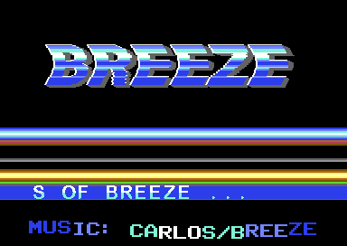

# BREEZE – C64 intro

A classic Commodore 64 intro for the demo group **Breeze**, written in 6510 assembly
(64tass) and developed and tested against the VICE emulator (`x64sc` 3.10, Apple-silicon Mac).

```
make run          # build + start in VICE            (or ./run.sh)
make disk         # optional: build/breeze.d64 with the intro on it
```



Press **SPACE** to leave: picture and music fade out, the machine resets to BASIC.
PAL only (the timing is cycle exact; on an NTSC machine it prints a message and returns).

## About this project – a Claude Code experiment

This intro is an **experiment** to test the capabilities of **Claude Code with Sonnet 5.5 (High effort)** using
**single-shot prompting**: the whole intro – research, code, tools, debugging in VICE, music, graphics – was
developed from the one prompt below, without any further instructions about the intro itself (the
later requests only concerned publishing this repository: creating it, pushing the source and adding the
prebuilt `.prg`/`.d64`).

According to the author (hvj78), the result is mind-blowing and far exceeds what Opus 5 was able to do
with the same kind of task at Max effort at the end of August, just a month earlier.

The original prompt, verbatim:

> I want to make a classic Commodore 64 intro. You know, the regular thing with a big Breeze logo on the upper side of the screen (Breeze is the name of my C64 demogroup). This logo should move up and down with some sinus based moving algorithm. I would be happy to see the logo moving not just up-down but also left-right. It would be nice to also make it wave. These effects could follow each other, extending or adding on top of each other, like first displaying Breeze logo with some fading effect, after that, start moving up-down, after that also add the left-right move and finally the wave effect. I would like to have a scroller also on the screen with borders open and the scroller should go out to the borders also. The scroller should have a 2x2 chars in size and have a nice charset. The Scroller should start at a static location but later it should start moving up-down a little, 2-3 chars in heights. I also would like to see some nice raster bars on the screen. Music should be a SID file from Carlos/Breeze - search for one online. The intro should have a nice fade out after pressing space key. Make a research online to learn, how to code Commodore 64 intros, what are the specifics of this retro machine, how to write the assembly for 6510 CPU, how to compile it, how to test it using VICE on my Macbook Air M1 machine locally. It would be great to make this development in a way, that you write the code, compile it, run the VICE, check the screen with computer use, and based on what you see in the VICE emulator, you fix the issues until the intro looks nice.

(No computer-use tool was available in that session, so "checking the screen" was done with VICE's remote-monitor
screenshots instead – see *How the development loop worked* below.)

## What you see

| time (approx.) | what happens |
|---|---|
| 0.5 s | the **BREEZE** logo fades in (6 fade levels, music volume follows) |
| 2.4 s | **copper bars** start to appear, one after the other |
| 3.2 s | the logo starts to move **up and down** (sine, FLD) |
| 9 s   | ... and **left and right** |
| 15 s  | ... and it starts to **wave** (per-raster-line horizontal offset) |
| 21 s  | the **scroller** (starts static at the bottom) begins to bob up/down (~3 chars) |
| always | a chrome **glint** runs over the logo, the **credit line** (sprites) waves in the *open bottom border*, SID tune by **Carlos/Breeze** |

* **Borders:** the vertical border is opened (RSEL trick, `$d011`). Sprites are only visible outside the
  display window because of that – the credit line under the scroller is drawn in what used to be the
  bottom border. The scroller itself can dip into that area (a char row can start at raster line 247 at
  the latest, so it reaches line 254).
* **Scroller:** true 2x2 character font (16x16 pixels per letter, 64 glyphs = 256 chars), fine scrolled with `$d016`,
  double-buffered (three small copy chunks per 8 pixels instead of one big shift).
* **Music:** *Magic* by Gábor Csordás (Carlos) / Breeze, 1996, from the High Voltage SID Collection
  (`MUSICIANS/C/Carlos_Breeze/Magic.sid`), relocated as raw code to `$1000` (init `$1000`, play `$1003`).

## Try it without any build tools

Ready-made binaries are in [`release/`](release/):

* `breeze-intro.prg` – `x64sc -autostartprgmode 1 -autostart breeze-intro.prg` (or drag it onto VICE);
  on a real C64 / other emulators: `LOAD"BREEZE-INTRO.PRG",8,1` then `RUN`
* `breeze-intro.d64` – disk image containing the intro as `BREEZE`: `LOAD"BREEZE",8,1` then `RUN`
  (or attach it in VICE with autostart)

PAL only. The `.prg` is about 49 KB; loading through an emulated 1541 takes a while, VICE's
"inject" autostart mode (`-autostartprgmode 1`) starts it instantly.

## Build & run

```sh
brew install vice 64tass          # macOS; VICE 3.10 and 64tass 1.60 were used
python3 -m venv .venv && .venv/bin/pip install -r requirements.txt   # only for the asset generator / tools
make                              # -> build/intro.prg   (also runs the cycle checker)
make run                          # start in VICE
```

`build/intro.prg` is a normal PRG (`LOAD"INTRO",8` / `RUN`, BASIC stub `SYS 2064`).
The generated graphics (`build/*.bin`) come from `tools/gen_assets.py`, which renders the logo, the 2x2 font
and the sprite text from system fonts at build time.

Useful `make` switches (`make CFG="NAME=value ..."`): `DEBUG_CPU=1` (border turns red while the per-frame
update code runs – a visual CPU meter), `DEBUG_BG=1`, `DEBUG_EDGE=1` (calibration stripe at a fixed cycle).

## How the development loop worked (no manual clicking)

`tools/vicetool.py` starts `x64sc` with the **text remote monitor** (`-remotemonitor`), waits, and sends
monitor commands over a socket: `screenshot "file.png" 2` (exact 384x272 PAL frame), memory/register dumps,
breakpoints with the raster line / cycle shown (`LIN CYC`), memory pokes. So the cycle:

1. edit the assembly, `make` (64tass + `tools/cyc.py` which sums the cycles of every raster cell from the listing),
2. `tools/timeline.py` / `tools/vicetool.py` run the PRG and take screenshots at chosen moments,
3. look at the pictures (or analyse pixels with Pillow), fix, repeat.

Other helpers: `tools/sid2bin.py` (strips the PSID header, prints load/init/play), `tools/profile.py` (py65 emulation of the per-frame update code, cycles per routine and per frame),
`tools/trace.py` (stop at a cell, show raster line/cycle), `tools/tune_stab.py` (search the stabiliser delays for
zero jitter using a calibration stripe), `tools/imgcols.py`.

## Research notes – how a C64 intro works (short version)

* **CPU/timing:** 6510 @ 0.985 MHz (PAL). A raster line is exactly **63 cycles**, a frame 312 lines = 19656 cycles, 50 Hz.
  Every instruction has a fixed cycle count (`tools/cyc.py` relies on that).
* **VIC-II:** the video chip owns the bus while it fetches. On a **bad line** (every 8th line inside the 25-row
  display window, when `raster & 7 == YSCROLL`) it steals cycles 12–54 from the CPU. Colour registers,
  scroll registers and video pointers can be changed *per raster line*, that is where nearly all C64 effects come from.
* **Stable raster:** a raster IRQ has up to 7 cycles of jitter. The *double IRQ* method (irq1 arms irq2 for the next line and
  sits in a NOP slide) cuts it to 0–1 cycle, a final `lda $d012 / cmp $d012 / beq` trick removes the last cycle
  (see `irq2` in `src/intro.asm`). With the textbook delay values VICE still showed a 1–2 cycle frame-to-frame
  wobble; `tools/tune_stab.py` (calibration stripe, 8 pixels = 1 cycle) tried all variants and only one is
  jitter free (10 of 10 frames on exactly the same cycle) – those values are the defaults.
* **FLD (flexible line distance):** rewriting `$d011` each line so `YSCROLL` never matches the raster line suppresses bad
  lines → the display data is pushed down by any number of lines. Here it positions the logo (y movement) and
  the scroller (bobbing) without ever moving memory. A subtle point found while debugging: the `YSCROLL` value must
  differ from the raster line *at every cycle* (offset never 0, also just before the write), otherwise
  the VIC enters "display state" without fetching and keeps drawing the stale line buffer.
* **Open top/bottom border:** clear RSEL (24-row mode) after raster line 247 but before 251 – the VIC never sets
  its vertical border flip-flop. Sprites (Y-expanded, the wrap-around trick puts a sprite at Y=6 on raster line 262) then show in the bottom border.
  Side borders are still closed, so sprites are hidden left of x=24 and right of x=344.
* **Logo wave:** multicolour character mode, `$d016` fine scroll (0–7 px) rewritten on every raster line; the coarse part
  is selected per character row with `$d018` (seven pre-shifted copies of the screen, no data copying at all).
* **Assembler:** 64tass (`.macro`, `.for` loops, `sin()`/`round()` for tables). VICE labels are written to `build/intro.lbl`.
* **SID:** a `.sid` file is a header plus a machine-code player (load address, init, play). Call init once, play once per frame.

## Verified how

* every raster cell is exactly 63 (or 20 + 43 stolen) cycles: `tools/cyc.py` after each build;
* the raster block starts on cycle 55 of line 46 in every frame (VICE monitor breakpoints + calibration stripe);
* per-frame CPU load (music included) averages 4.3K, worst 5.1K cycles, the block leaves ~6K (`tools/profile.py`);
* screenshots of every phase of the timeline, a warp-speed soak test (amplitudes at maximum, frame counter wrap),
  the SID output recorded through VICE's WAV driver (signal present, level follows the fade-in), and the SPACE exit
  (fade-out of picture and volume, reset to BASIC, verified by setting the exit flag – the key matrix read itself
  is the standard `$dc00=$7f / $dc01 bit 4`).
* Not tested on real hardware or NTSC machines.

## Source overview

| file | contents |
|---|---|
| `src/intro.asm` | boot/exit, IRQ stabiliser, the **raster block** (cell macros), memory map |
| `src/update.asm` | per-frame engine: timeline, logo/wave math, scroller, bars, fades, sprites, glint |
| `src/data.asm` | sine/wave/fade tables, palettes, scroll text |
| `tools/gen_assets.py` | logo tiles, 2x2 font, sprite text (uses `tools/font8x8.py`) |
| `tools/*.py` | VICE remote control, cycle checker, profiler, tuning helpers |
| `music/` | `Magic.sid` (original) and the raw data used in the PRG |

The scroll text is in `src/data.asm` (`scrolltext`, ASCII, 0-terminated); all timings are constants at the top of
`src/update.asm` (`T_YMOVE`, `T_XMOVE`, `T_WAVE`, `T_BOB`, amplitudes `AY_MAX`, ...).

## Credits / licences

Music: *Magic* – Gábor Csordás (Carlos) / Breeze, 1996 (HVSC). The logo and font bitmaps are generated at build time
from fonts installed on the build machine (Arial Black / Arial Rounded Bold); regenerate them from a font you
are allowed to use if you plan to redistribute.
